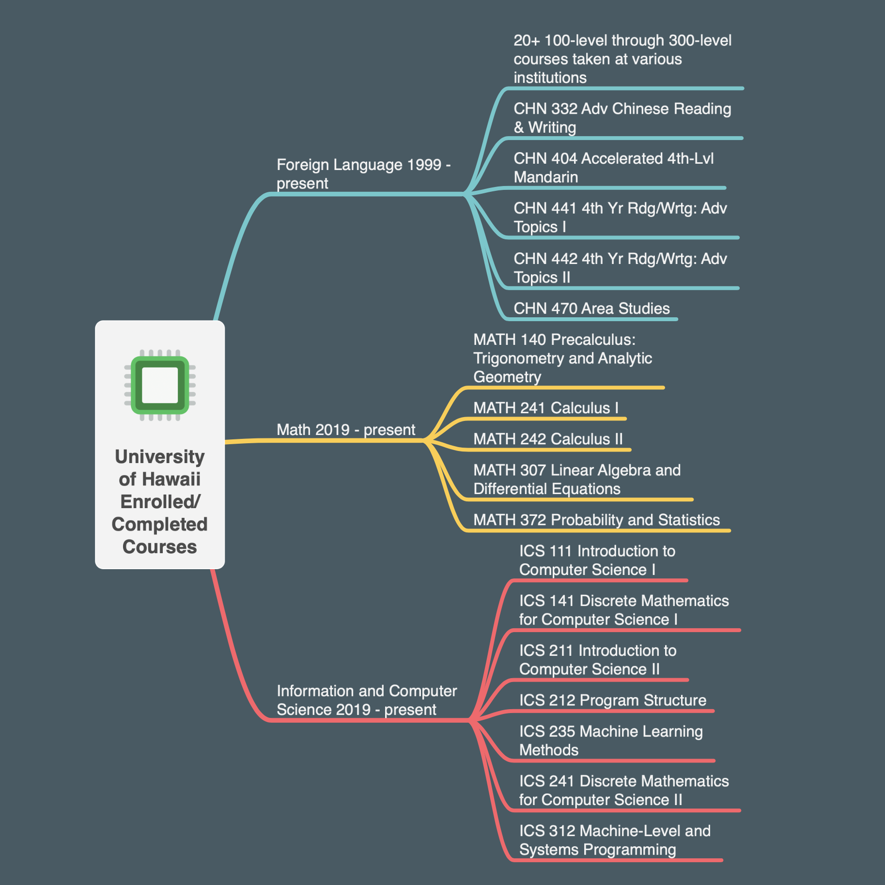

My story in Computer Science began over 30 years ago. I wrote my first program in elementary school back in the mid-80's. I attended public school in Mountain View, California and like the youth of today, most of us grew up playing video games. The difference was to play a game back then it usually required some knowldege of DOS, and a lot of floppy disks. Whenever someone's family purchaced a new computer, we would at that friend's house for months until the next upgrade came out. I remember rushed over to play Ultima on my friend's new i486 and the character just darted across the screen. We had to underclock it to be able to play but boy was I jealous. My character moved like a snail after that. Nevertheless, my upbringing should have led me to be a computer geek for life but after life's many twists and turns I ironically ended up in the military.

Jumping forward to today, I recently bid farewell to the military after over two decades of service. The decision to retire was quite simple. I wanted to do more with my life and the opportunity to retire at 20 years is too good to pass up. If you are interested in some of the considerations, I recommend this blog post by Tim Kane, https://warontherocks.com/2015/03/military-retirement-too-sweet-a-deal/. Like many others, I progressed quickly through the ranks but after reaching the peak in my field there was not much to do. I never deployed, only fired a weapon one time during basic training, and only moved a few times, usually to a new house not far from the old one. It was fairly uncharacteristic of what most people thing of the military. 

Don't get me wrong, my job was awesome, but the reality check for me came as I was being groomed for "senior leadership" positions. I took the required classes, and mingled with the appropriate people but I did not want to end up spending my last ten years playing volleyball and pretending to work. No offense to those of you who excel at that sort of thing but the move into management can be like getting stuck in a for-loop. You might have gotten there by accident, and there might not be a way back out. 

Instead, I decided to try something new. Shortly after departing the military I received a random job offer to work as a liaison officer with the Pentagon. In my interview I explained that I did not have even the most basic requirements for the job but somehow the employer and goverment were both convinced I would be a perfect fit. I acccepted the challenge and found myself at a new phase in my life, no longer lamenting about giving up my technical job and instead I actually enjoyed working with all the "senior leaders." I had the opportunity to work with some of the greatest military and civilian minds. It may come as a surprise to some, but the Department of Defense (and all the 3- and 4-letter affiliated agencies) is filled with talented people, regardless of who's in the White House.

While my time in the military and my follow-on work did not directly relate to Computer Science, I still managed to make a hobby of at least keeping up with technology. I also taught myself PHP and MySQL and challenged myself to explore ways to get creative with technology at work. Ultimately, my position moved to D.C. and I did not want to leave Hawaii just yet. 

Lucky for me, I got the opportunity to pursue a second degree at UH Manoa. As a relative new Computer Science student (second year), I am extremely eager to learn more. Each class has been amazing and I hope one day I can contribute back to the community. Personally, I am interested in Natural Language Processing and anything related to Data Science. Last semester, I took a Machine Learning class where we implemented some supervised and unsupervised learning models (KNN, k-Means, etc.) and we also had a brief introduction into Neural Networks.   

........not finished......

How do we solve the problem. 

Paragraph II. Testing to see if this works...

Yada.

