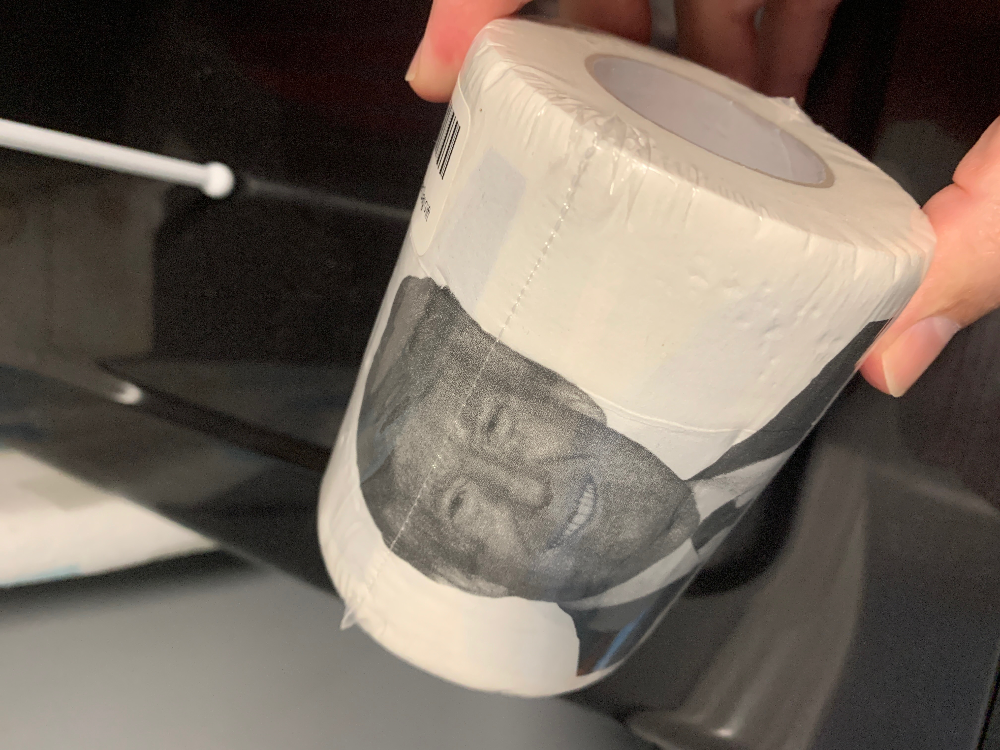

## coronavirus + college = crisis

College is tough. Each semester presents a new set of challenges as schedules change, teaching styles vary, and concepts become more difficult. I am fortunate to have the opportunity to pursue a second degree in Computer Science, but despite being job-free, I am not free from other responsibilities. The recent Covid-19 pandemic has impacted most of our lives to some extent, and as with everything in life, comes with pros and cons. As a former Chinese teacher, whenever things seem really bad, I am reminded of the notion that "crisis" in Chinese, [危机 (wéijī)](http://pinyin.info/chinese/crisis.html), is a compound of the words danger and opportunity. Accuracy aside, it is a perspective. Managing family life and college life is definitely overwhelming at times but there is a silver lining.

## Too Many Classes - Crisis #1
This semester in particular is probably the toughest thus far. I am now in my second year as an undergraduate, and despite the warnings from advisers and peers, I signed up to take four of the most time-intensive classes offered. Week one, each professor said we should probably be spending about 10-20 hours per week outside of class. Hm. Forty hours is somewhat manageable, but 80 hours outside of class with a family is not very realistic. I am married with four children, ages 3 through 22. Two of them are on their own but still require a certain level of parenting from time to time. Moreover, my wife was diagnosed with cancer late last year and we anticipated her treatment would be finished before the semester began. It was postponed and took place during the first couple months of the semester instead. Fortunately, she is now doing much better and no longer has daily trips to the doctor, but the day her treatment ended, we received word schools would transition to online instruction due to the Coronavirus pandemic.

## E-learning - Crisis #2

Online instruction has been hard on teachers and students alike. Some classes such as Software Engineering and Algorithms were somewhat pre-aligned for a more natural transition considering much of the material was online already, but others such as Linear Algebra and C/C++ have been a bit more difficult to manage. Everyone is doing their best to cope. Teachers are compelled to learn new tools and methods while students are essentially dumped into a more autonomous atmosphere. In reality, in-person classes and online instruction are fundamentally different and require different sets of skills to succeed.

I traditionally prefer in-person instruction, especially for more complex subjects, and normally only register for online classes when I feel I can digest the material on my own, or if I have enough time (and space) to handle it on my own. My daily grind this semester has been to watch (or listen to) YouTube and screencasts while commuting to and from campus, attend all lectures, and do as much homework as possible in the library or ICS spaces, often times with other students. Once at home, I have family responsibilities, chores such as cooking and cleaning, and of course my children need help with their homework. I usually cannot focus much until my 3-year old is asleep which typically ends up being about 8-9 pm at night. It took a while, but I slowly managed to come up with a schedule that seemed to work. After Spring break, my schedule no longer worked.

## Lock-down (with kids) - Crisis #3
School closures and subsequent statewide shelter-in-place orders meant my evening routine suddenly became my full-time routine. My wife's job also allows her to work from home now and of course all the kids are at home, everywhere. My youngest no longer has kids to play with and cannot visit the park to burn off energy which means we take turns playing with him throughout the day. Even as I write this post, my son is driving my wife crazy so I will take over and come back to finish later. They decided to go for a drive. "Going for a drive" is one of our new pastimes. We also go for walks, jogs, bike rides, etc., regularly throughout the day just to get everyone out of the house, sticking to the neighborhood sidewalks or the backyard when out and about. Sure I cannot keep up with my studies, but my 3 year old now jogs between 2-4 miles per day and he even learned to use a power drill (whatever we can think of to keep him occupied).

When I was in my 20's, I was a single dad with two children for five years while working full time in the Air Force, so I am not entirely new to this way of life, but attending college at home with children present just takes it to a whole new level. I often keep my Zoom mic on mute because my son is always talking. My house has an open floor plan so there is not much I can do about it. It hasn't happened too often, but occasionally my wife's Zoom meetings are scheduled during the same time as my classes so she usually lets him play nearby and I run over if he gets too disruptive. I usually cannot follow the Zoom lectures too well due to the various distractions but some teachers are kind enough to record them. Fortunately, there is a plethora of free online training made available now, in addition to learning from YouTube. I recently have been a fan of Princeton's [CUvids](https://cuvids.io/), offered for free until the end of the semester. I'm not sure if the offer was meant for me since I don't attend Princeton, but I was able to sign up using my UH e-mail account. I may not pass Algorithms this go around, but at least I am learning still.

## Family Problems - Crisis #4
My eldest son works as a software engineer in [Japan](https://www.cnn.com/2020/04/03/asia/tokyo-coronavirus-japan-hnk-intl/index.html). We usually communicate frequently via Line, and although is is doing well, I do worry about him. He lives in Tokyo and only recently got permission to work from home. He typically takes the subway to and from work, and the crowded subways where he lives do not afford much elbow room, let alone the 6-ft social distancing recommendation. A man who frequents the same line recently tested positive for Covid-19 and despite the country's best efforts to keep the virus under wraps, they are really just a bit behind the rest of us. Moreover, like many of us, my son has also been naive about the situation until recently. My daughter on the other hand lives in Hawaii, so she seems relatively safe from the virus for now; however, she's lost one job and her second job cut her work hours down to one day a week. She is now re-considering joining the military, once they begin hiring again.

## The Bright Side
As I reflect on everything happening at home and abroad, and write about the struggles of suddenly learning or working from home, I cannot help but feel somewhat selfish, or privileged. After all, I have access to basic needs: food, water, and wifi. Our home is safe, and free from Coronavirus for the time being. I am with my family each day and not under full-on quarantine. Luckily, I canceled my job interview that was to take place over Spring break or I may be stuck there, or worse. And now, I am sitting in my air-conditioned house, writing about how tough it is to learn despite having access to so many resources. It is really easy to get swept up in all the bad things going on around us, but when we do, it's important to stop and take some time to think about the positive things (not Covid-19 positive though).

## TP-minus-1 Countdown Crisis
Finally, I should probably mention the TP crisis. Toilet paper is hard to find these days. My wife has been wanting me to buy a bidet for years so after my last failed trip to Costco to secure the must-haves, I finally broke down and ordered one from Amazon. Crisis averted..., as long as Amazon workers don't go on strike. And if they do, I still have this:

Not quite a silver lining, but close. Stay safe, everyone.