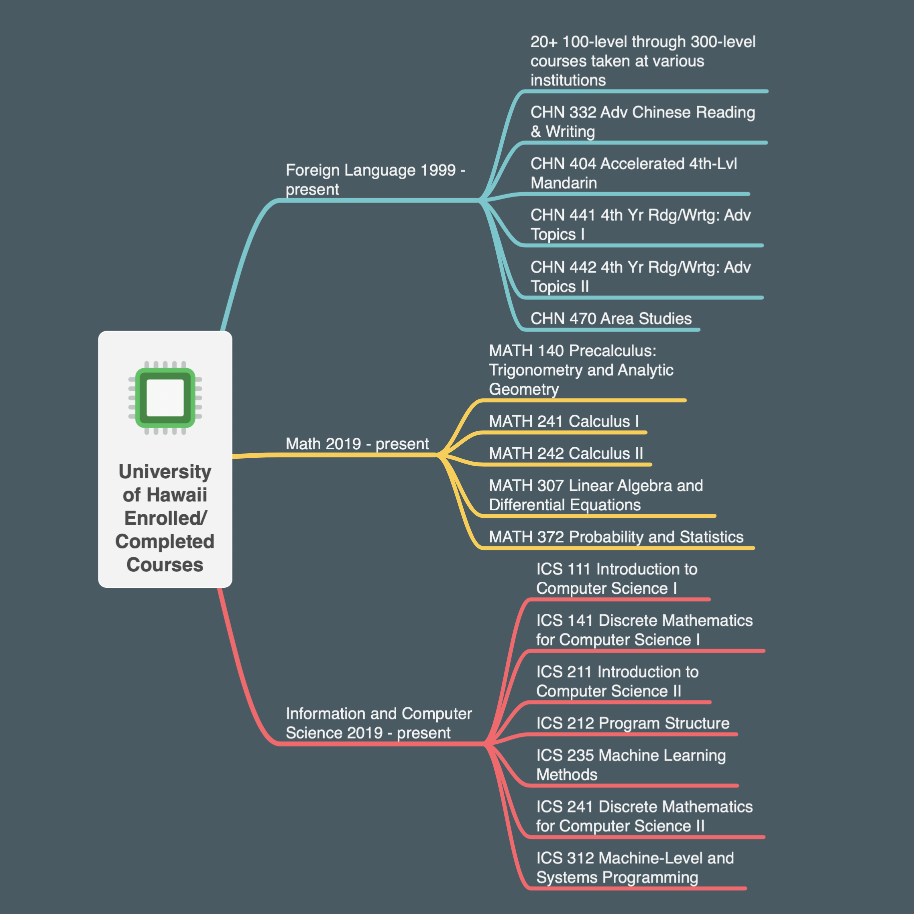

<h2>The Wonder Years</h2> 

My story in Computer Science began over 30 years ago. I wrote my first program in elementary school back in the mid-80's. I attended public school in Mountain View, California and like the youth of today, most of us grew up playing video games. The difference was that to play a game back then usually required some knowldege of DOS, and a slew of floppy disks. Whenever someone's family purchaced a new computer, we would gather at that friend's house for months until the next upgrade came out. I remember rushing over to play Ultima on my friend's new i486 and getting a kick out of how fast the character darted across the screen. We had to underclock it to be able to play. My vesion of the game was just lame thereafter. Nevertheless, my upbringing should have led me to be a computer geek for life, but after many twists and turns, ironically, I ended up in the military.

<h2>Air Force Experience</h2> 

Jumping forward to today, I recently bid farewell to the military after over two decades of service. The decision to retire was quite simple. I wanted to do more with my life and the opportunity to retire at 20 years is too good to pass up. If you are in the military and unsure about when to retire, I recommend this blog <a href="https://warontherocks.com/2015/03/military-retirement-too-sweet-a-deal/">post</a> by Tim Kane. Like many others, I progressed quickly through the ranks but after reaching the peak in my field there was not much to do. I never deployed, only fired a weapon once during basic training, and moved just a few times, usually to a new house not far from the old one.

Don't get me wrong, my job was awesome, but the reality check for me came as I was being groomed for "senior leadership" positions. I took the required classes, and mingled with the appropriate people but I did not want to end up spending some of my best years playing volleyball <a href="https://static.dvidshub.net/media/pubs/pdf_41487.pdf">(yes, it's a thing)</>. No offense to those of you who excel at that sort of thing, but to me it seemed like getting stuck in a poorly coded for-loop. You might be there by accident, and you might be there for a while, with no escape. 

<h2>Joint Staff Experience</h2> 

Instead, I decided to try something new. Shortly after departing the military I received a random job offer to work as a liaison officer with the Pentagon. In my interview, I explained that I did not have even the most basic requirements for the job but somehow the employer and goverment were both convinced I would be a perfect fit. I acccepted the challenge and sure enough, they were right. I found myself at a new phase in my life. I no longer worried about being the best, and I discovered working with the "senior leaders" was actually very rewarding. I had the opportunity to work with some of the greatest military and civilian minds. It may come as a surprise to some, but the Department of Defense (and all the 3- and 4-letter affiliated agencies) is filled with talented people, regardless of who's in the White House.

While my time in the military and my follow-on work did not directly relate to Computer Science, I still managed to make a hobby of at least keeping up with technology. I also taught myself PHP and MySQL and challenged myself to explore ways to get creative with technology at work. Ultimately, my position moved to D.C. and I did not want to leave Hawaii just yet. 

<h2>Back to School!</h2> 

Lucky for me, I got the opportunity to pursue a second degree in Computer Science at UH Manoa. As I enter my second year, I am just about finished with the mandatory courses needed to stretch my wings. Each class has been amazing thus far and I hope one day I can contribute back to the community. Personally, I am interested in Natural Language Processing and anything related to Data Science. Last semester, I took a Machine Learning class where we implemented some supervised and unsupervised learning models (KNN, k-Means, etc.) and we also had a brief introduction into Neural Networks.

Why am I interested in Software Engineering? The feeling I get after watching this short Wall Street Journal <a href="https://www.youtube.com/watch?v=xxBc1c3uAJw">video</a> or other similarly inspirational videos probably sums up my thoughts better than words. I have some ideas one how to make the world a better place, one line of code at a time.  

