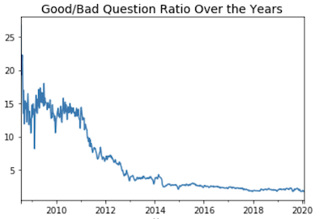
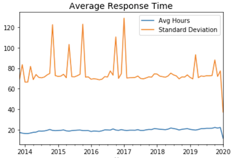

What exactly is a good question on Stackoverflow? The answer is literally posted in broad daylight at  [StackOverflow](https://stackoverflow.com/help/how-to-ask). This page covers almost everything. Right at the top, you will find a large “Search” hyperlink. While it may seem obvious, the number of questions asked time and time again are insane. Do not frantically post questions without first doing some proper research. Next up, the help page covers how to formulate a well constructed, professional question, beginning with the title, structure, grammar, the to-dos and not-to-dos, and includes a reminder to proof-read before posting. They even have sub-sections to discuss things like, “How do I ask and answer homework questions?” So why are there still so many bad questions? That is a silly question. 

Although my guess is that most people do not take the time to read the help section, perhaps some people just do not even have the time to think about it. They need answers and they need them now. I know when I am stuck on a problem or have a tight deadline it would be nice to have an answer immediately. Searching takes up too much time, and the time it takes to craft the perfect question might be better spent solving the problem independently. Google is for curiosity while StackOverflow is for expert help, quickly. This could be the reason, or it could be that many people do not even care. 

I do not want to jump to conclusions so I decided to heed the advice of the help section and first search for a clue. My search quickly brought me to another awesome resource, [StackExchange](https://data.stackexchange.com/stackoverflow/). This is where we begin the journey for the truth. 

<h2>Follow the Bread Crumbs</h2>

StackExchange allows users to run database queries on all sorts of fun and useful information. Most importantly, many users have already written amazing queries and all we have to do is use them to piece together what may be happening. Ideally, I would love to take the results and run some Machine Learning models to explore the data further, but in the interest of time, I will focus on a few discoveries. If not, I could (and would gladly) spend months sifting through all this data. In fact, if I found this site a few months ago I would have definitely used it for my Probability and Statistics class. 

I first looked for some interesting sounding query titles. Here are some examples that I found: 

- Good Questions vs. Bad Questions Ratio
- Time to Answer
- Posts containing a very short title
- Most Down-Voted Questions
- Users by Popular Question ratio
- Find the top 200 questions with most views
- Fastest Guns in the West
- High Standards - Top 100 Users that rarely upvote
- Find interesting unanswered questions
- Jon Skeet comparison

## Good Questions vs. Bad Questions Ratio

This is a quick and dirty query that produced a timeline .csv file. Looking at the numbers might not be exciting for everyone so I downloaded the file and whipped out my Python notebook to quickly make this rudimentary graph. It is pretty apparent that the ratio of good-to-bad questions has plummeted over the years. I have a few guesses as to why it may be but we might have to dig a bit deeper to find out. My hunch is that the site began with mostly professionals (asking “good” questions) and blew up exponentially as people began finding answers via Google search. 

## Time to Answer

While I had Python opened and the simple code to make the first graph already up, I decided to download another file and take a look at the average response time over the years. Its curiously stable. The blue line indicates the average time it takes to get an answer is less than 20 hours. However, the standard deviation is quite large so do not be surprised if you need to wait a bit longer. That said, if it has been over a day, or worse, over a week, and your question has some views with no answers, it might mean you need to 1) search for a solution elsewhere, or 2) reword your bad question.



## Posts containing a very short title</h2>

What constitutes a bad question? 

Not surprisingly, most of the posts with three words or less have very low scores. This is clue number one. If you only post three words, why would anyone spend more than one second to answer. Time is valuable and most people want to avoid wasting their time, especially if your question winds up being as bad as the title. There was one post, however, that stood out from the rest. It was actually posted 10 years ago and was titled, “[TFS vs SVN](https://stackoverflow.com/questions/661389/tfs-vs-svn).” It had about 59 upvotes but was subsequently closed by moderators for being opinion-based. This is another no-nos. 

## Most Down-Voted Questions

Are questions with a high volume of down-votes bad questions? Yes, and no. One of the top downvoted questions that showed up in the query asked, “How to send 100,000 emails weekly?” When I first saw the title, I wanted to reach into the computer and strangle this spammer (especially seeing that it was tagged PHP), but someone actually responded! And guess what? The answer had five times as many upvotes. They offered a short answer, and a long…and very detailed, answer. Moderators closed the post seven years ago but I am sure plenty of spammers out there are grateful that “[Piskvor left the building](https://stackoverflow.com/users/19746/piskvor-left-the-building)” responded. After all, it is a valid question if run a newsletter. The problem with the question was, other users may have initial reactions similar to mine, and therefore it was ultimately deemed too controversial for StackOverflow. 

## Users by Popular Question ratio

For an example of a good question, I decided to look at users that commonly post good questions. User “None” had a few. His/her top post, [Function pointers, Closures, and Lambda](https://stackoverflow.com/questions/208835/function-pointers-closures-and-lambda), explains they were learning something new, and while READING a book on the subject, pondered the question, “So why are C-style function pointers fundamentally different from closures or lambdas?” They explained in a bit more detail, and then reiterated the question with a good old-fashioned please and thanks at the end. Not the best question ever, but I can certainly see why it received a number of upvotes. 

## Find the top 200 questions with most views

### How Do I…

What is the best question? I do not have the answer for that but some of the best are found in the next anonymously written query. I forked the query and changed the CreationDate to date back to 2010. 

Here is an example of the code: 
```SQL
SELECT TOP 200 ViewCount, Id AS [Post Link], Tags, Title, AnswerCount, CreationDate
FROM Posts 
where CreationDate > '2010/01/01'
ORDER BY ViewCount DESC;
```


