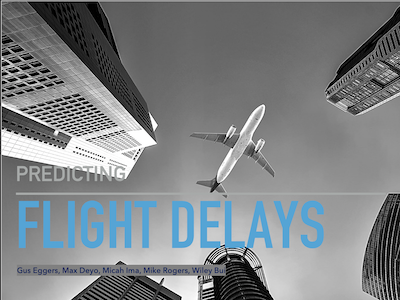
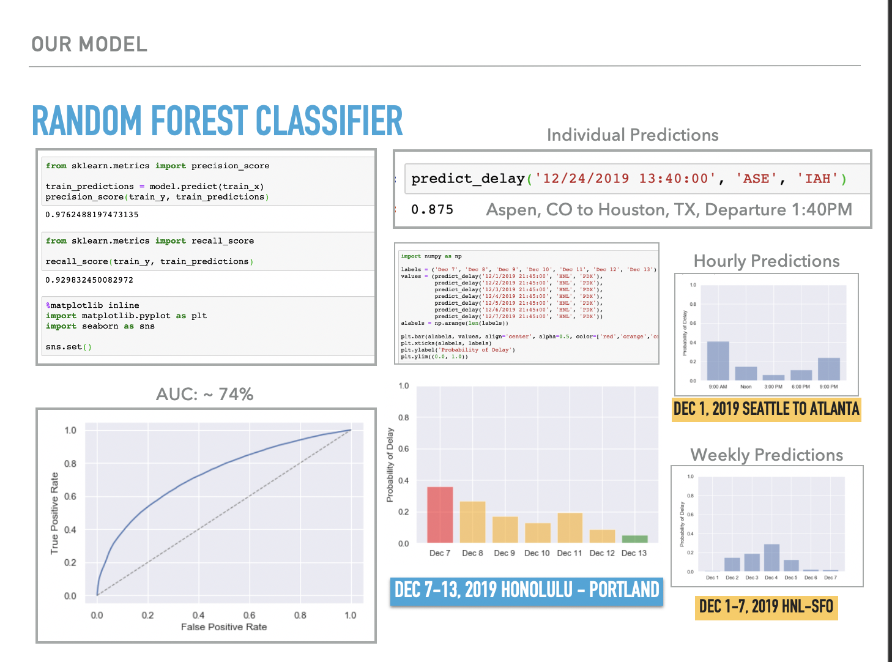
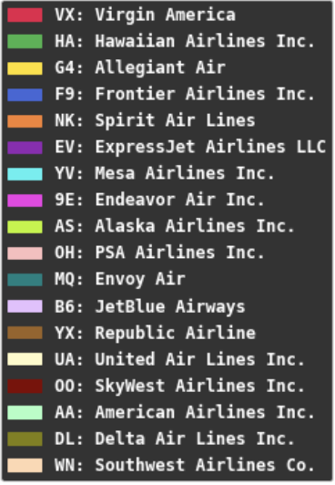

<div class="ui small rounded images">
  
  
  
</div>


# Tools Used

Although this project designed to showcase skills we learned from our Probability and Statistics course (MATH 372), most of our team had more experience with Python rather than the recommended R. Also, through Google Drive and Colab (a Python Notebook collaborative tool), we were able to easily communite ideas and code.

### Python Notebook
- Anaconda
- Google Colab

### Frameworks/libraries:
- sklearn
- matplotlib
- pandas
- numpy
- seaborn
- scipy
- XGBoost
- Catboost
- LightGBM

### Dataset repositories:
- https://opendata.socrata.com/
- https://archive.ics.uci.edu/ml/datasets.php
- https://www.kaggle.com/datasets
- https://toolbox.google.com/datasetsearch
- https://www.data.gov/
- https://data.worldbank.org/
- https://www.transtats.bts.gov/DL_SelectFields.asp?Table_ID=236
- https://catalog.data.gov/dataset/airline-on-time-performance-and-causes-of-flight-delays
- https://www.bts.gov/topics/airlines-and-airports-0

Most of flight delays can be attributed to three main factors. The leading factor is waiting on an
aircraft that simply arrives late. The next is air carrier delay, which can be maintenance, cleaning,
baggage loading or fueling related. The third leading factor is a National Aviation System Delay,
which can be due to many reasons, such as : non-extreme weather, heavy traffic volume, or air
traffic control.

* SkyWest has an 11% delay rate, consistently long delay time.
* Southwest has a 22% delay rate, however not as long of a delay time as SkyWest.
* Delta has a 10% delay rate, with delay times being an average of SkyWest and Southwest’s time.
* Based on the data, the most likely airlines to have a delayed flight are (in order) : Southwest, American, SkyWest, Delta, United, and JetBlue.
* Out of these airlines, SkyWest, Delta, United, and American have the longest delays. Therefore, they tend to be riskier airlines to choose a flight with if you’re on a time crunch

Here is some code that illustrates how easy it was to predict delays using our model:

```python
predict_delay('01/23/2020 13:40:00', 'ASE', 'IAH')
#sample output (Aspen, CO to Houston, TX, Departure 1:40PM, 87.5% chance of delay.)
```
