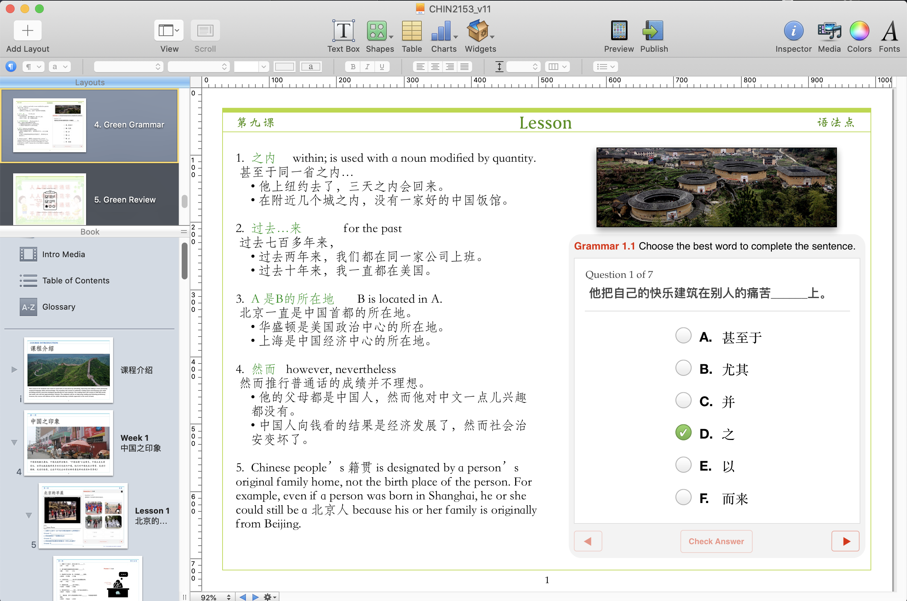

*This graphic shows what a typical layout looks like. This tool allowed us to change page styles to match certain lessons or keep them consistent throughout the book if needed.*

## Design Considerations
- iBooks Author offered layouts style multiple lessons/pages at once
- Table of contents and overall arragment of lessons
- UI/software brand new to most teachers/students
  -- we added icons and an icon info page near the beginning of the book. This helped with the learning curve
- Reduced image/video sizes to minimize download/upload times
  -- When available, linking audio/video was preferred over embedding
  -- Some embedding was necessary considering the students could be without internet access outside of school

## Software
- We used some pre-designed software from a company called BookWidgets and also designed some in-house Widgets
- The Widgets run off HTML5 and it was fairly simple to build widgets that can display web pages. For example, one Widget we created interfaced with Quizlet.com to provide students with an easy/familar means to study new vocabulary.
- We also made some widgets to interact with Google docs and Google Forms. Using Google Forms was a great way to have students input answers without having to the the iBook. Teachers could see submitted answers immediately and provide feedback.

## Built-in functions
- There were many features that came with iBooks Author, such as some pre-designed interactive widgets. 
- One of the most useful widgets that came pre-installed was a self-check quiz. The results were not shared but it was nice for students to just quickly check if they understood the material. 

## Complications
- One of the biggest problems we encountered was the general lack of support for foreign language fonts. There were hacks to get certain fonts to appear but the setup of the school did not allow us to alter individual iPads very often. The main issue with fonts is that the iBooks Author used some fonts while iPads and iPhones used alternate fonts. This affected the layout of certain lessons and we were forced to redesign many pages to account for the inconsistancies.

I could probably write an entire book on the all the intricacies of the ISD process but I am sure someone has written something great already. 

This was a fantastic side project and I was able to brush up on my Chinese while learning some new techonologies.
