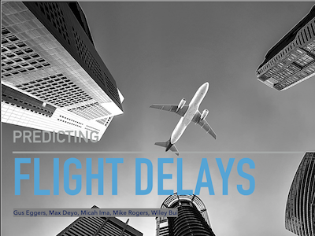
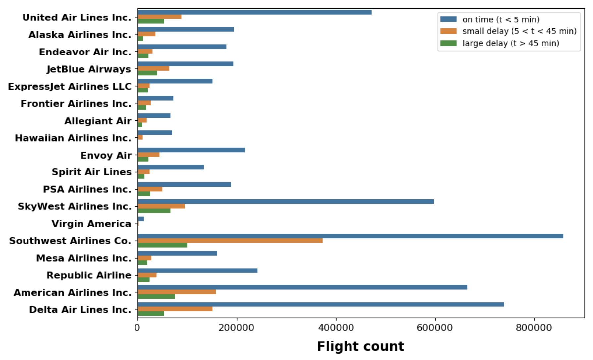

Our four-person team processed travel information for over 1 billion travelers in 2018 and developed a model to predict probability of delay based on origin, destination, and date/time of travel. The goal was to develop a system for frequent fliers to better manage their travel schedules.

## Tools Used

This project focused on applying Math skills we learned from our Probability and Statistics course and we had an option of using R, Python, or Excel to analyze the data. We chose Python since a few of our team members already had experience with the language. Also, through Google Drive and Colab (a Python Notebook collaborative tool), we were able to easily communite ideas and code. Python also allowed us to process over 6 million flight records whereas Excel would not be able to handle such a task. 

### Dataset repositories:
- https://opendata.socrata.com/
- https://archive.ics.uci.edu/ml/datasets.php
- https://www.kaggle.com/datasets
- https://toolbox.google.com/datasetsearch
- https://www.data.gov/
- https://data.worldbank.org/
- https://www.transtats.bts.gov/DL_SelectFields.asp?Table_ID=236
- https://www.bts.gov/topics/airlines-and-airports-0

## Results


Most of flight delays can be attributed to three main factors. The leading factor is waiting on an
aircraft that simply arrives late. The next is air carrier delay, which can be maintenance, cleaning,
baggage loading or fueling related. The third leading factor is a National Aviation System Delay,
which can be due to many reasons, such as : non-extreme weather, heavy traffic volume, or air
traffic control.

* SkyWest has an 11% delay rate, consistently long delay time.
* Southwest has a 22% delay rate, however not as long of a delay time as SkyWest.
* Delta has a 10% delay rate, with delay times being an average of SkyWest and Southwest’s time.
* Based on the data, the most likely airlines to have a delayed flight are (in order) : Southwest, American, SkyWest, Delta, United, and JetBlue.
* Out of these airlines, SkyWest, Delta, United, and American have the longest delays. Therefore, they tend to be riskier airlines to choose a flight with if you’re on a time crunch

## Sample Code

Here is some code that illustrates how easy it was to predict delays using our model:

```python
predict_delay('01/23/2020 13:40:00', 
              'ASE', 
              'IAH')
#sample output (Aspen, 
                CO to Houston, TX, 
                Departure 1:40PM, 
                87.5% chance of delay.)
```

I gained valuable experience finding and pre-processing large datasets, building charts and graphs for exploratory data analysis (EDA), and choosing the best prediction model for the job. I used one Python notebook for EDA, and then used a separate notebook to test different models. Ultimately, I picked a random forest classifier and acheived decent results. The whole project took about two weeks to put together after planning and discussing options for a month. 

WHere are a few snapshots from the EDA stage: 





