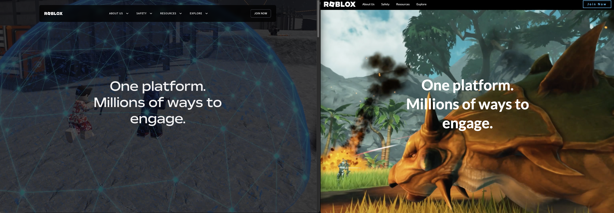

*Side-by-side comparison of the original Roblox landing page and my clone implementation.*

## Project Overview

To solidify my understanding of Semantic UI and React, I recreated the frontend of the Roblox landing page as a solo project. This exercise quickly moved beyond basic implementation into tackling the real-world complexities and limitations of UI frameworks.

## Development Journey

What began as a straightforward implementation exercise evolved into a deeper exploration of framework capabilities and constraints:
- Started with component identification and structural planning
- Mapped Roblox UI patterns to available Semantic UI components
- Discovered significant limitations that required creative solutions
- Developed increasingly sophisticated workarounds as challenges emerged

## Technical Challenges

The project revealed several significant framework limitations that required creative problem-solving:
- **Style Customization**: Semantic UI's default styles required precise CSS overrides for hover effects and interactive elements
- **Feature Constraints**: Video autoplay implementation limitations led to sourcing and adapting an alternative interactive image solution
- **Responsive Grid**: Implementing the exact responsive behavior proved particularly challenging, requiring extensive experimentation and debugging
- **Performance Optimization**: Balancing visual fidelity with performance required careful asset optimization

## Solutions Implemented

- Created a custom CSS layer to override Semantic UI defaults while maintaining framework benefits
- Developed hybrid components that leveraged framework structure while implementing custom behavior
- Built responsive breakpoints that closely matched the original site's behavior on various devices
- Implemented performance optimizations for smoother animations and transitions

## Skills Demonstrated

This project showcases my abilities in:
- Frontend development using React and component-based architecture
- CSS troubleshooting and framework customization
- Understanding the tradeoffs between frameworks and custom solutions
- Problem-solving when facing technical constraints
- Self-directed learning and implementation

## Key Takeaways

This project taught me valuable lessons about frontend development:
- The importance of understanding underlying technologies even when using abstractions
- How to evaluate UI frameworks for specific project requirements
- Techniques for extending framework capabilities when necessary
- The balance between leveraging existing tools and building custom solutions